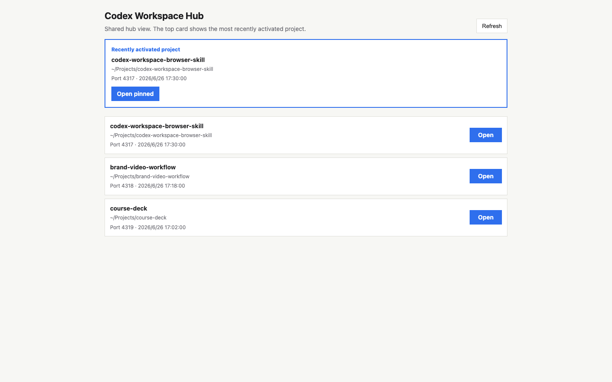
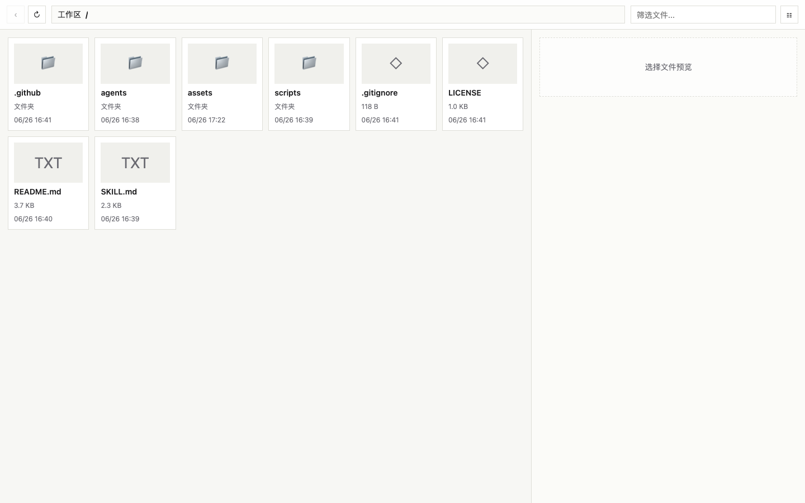

<p align="center">
  
</p>

# Codex Workspace Browser Skill

A lightweight Codex skill that opens local project files in the Codex in-app browser instead of macOS Finder.





## What It Does

- Starts a local project file browser bound to `127.0.0.1`.
- Starts a fixed workspace hub at `http://127.0.0.1:4316/`.
- Registers multiple projects in one hub.
- Supports pinned project URLs such as `http://127.0.0.1:4316/?root=...` to avoid cross-thread confusion.
- Restricts each project browser to its selected root folder.
- Gives Codex a clear `WB_OPEN` / `WORKSPACE_BROWSER` workflow.

## Requirements

- macOS
- Node.js available as `node`
- Python 3 available as `python3`
- Codex with local skills enabled

This first release uses macOS `launchctl` for background services. Linux and Windows support can be added later with `systemd`, PowerShell, or a foreground mode.

## Install

Clone this repository, then run:

```bash
scripts/install.sh
```

The installer copies files into `${CODEX_HOME:-$HOME/.codex}`:

```text
bin/open-workspace-browser
bin/open-workspace-hub
bin/wbopen
tools/workspace-browser.js
tools/workspace-hub.js
skills/workspace-browser/
```

Restart Codex after installation if the skill metadata does not appear immediately.

## Usage

Open the current working directory:

```bash
$HOME/.codex/bin/wbopen "$PWD"
```

You can also invoke the skill from Codex with:

```text
WB_OPEN
```

For scripted or repeatable workflows, prefer the explicit `wbopen` command.

## URLs

- Fixed hub: `http://127.0.0.1:4316/`
- Project browser: assigned automatically from `4317` upward
- Pinned hub URL: printed as `Pinned hub: ...` by `wbopen`

## Uninstall

```bash
scripts/uninstall.sh
```

The uninstaller removes launchers, tools, skill files, and LaunchAgents. It leaves registry and logs in place so users can inspect or delete them manually.

## Configuration

By default, Workspace Browser uses:

- Hub port: `4316`
- Project browser ports: `4317` and upward
- Install root: `${CODEX_HOME:-$HOME/.codex}`
- Registry: `${CODEX_HOME:-$HOME/.codex}/workspace-browser-registry.json`

The launchers create macOS LaunchAgents under:

```text
~/Library/LaunchAgents/
```

## Security Notes

- Services bind to `127.0.0.1`, not a public network interface.
- File access is locked to the selected project root.
- The hub stores local project paths in:

```text
~/.codex/workspace-browser-registry.json
```

Do not expose these local ports to the public internet.

## Contributing

Issues and pull requests are welcome.

Before opening a pull request, run:

```bash
node --check scripts/workspace-browser.js
node --check scripts/workspace-hub.js
bash -n scripts/open-workspace-browser
bash -n scripts/open-workspace-hub
bash -n scripts/wbopen
bash -n scripts/install.sh
bash -n scripts/uninstall.sh
```

The repository also includes a GitHub Actions workflow that runs these checks on push and pull request.

## License

MIT License. See [LICENSE](LICENSE).

## Disclaimer

This is an unofficial community skill for Codex. It is not affiliated with or endorsed by OpenAI.
